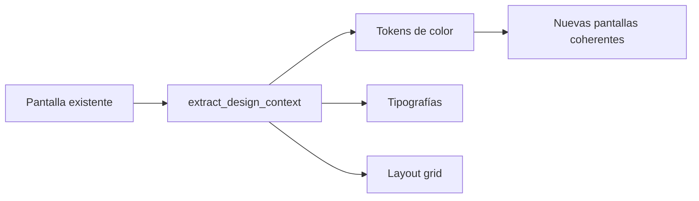

# Integración MCP: Google Stitch + Nano Banana

> Análisis profesional de cómo estas dos herramientas potencian el proyecto iclinicas.
> Fecha: 2026-05-07

---

## 1. Google Stitch — Diseño UI generativo

Stitch es un generador de diseños UI de Google Labs (Gemini 2.5 Pro). Conectado vía MCP, permite a un agente generar, analizar y extraer pantallas desde el navegador de diseño.

### 1.1 Extraer sistema de diseño actual

Antes de crear nada nuevo, se puede extraer el "Design DNA" de las pantallas existentes:



**Valor para iclinicas:** Garantiza que cualquier nueva landing de especialidad o servicio mantenga la paleta exacta (`--color-primary: #0A6B5E`, tipografía Newsreader/Inter, espaciados). Sin desviaciones visuales.

### 1.2 Acelerar creación de landings por especialidad

Actualmente hay 11 especialidades. Cada una tiene su página (`/especialidades/*`). Stitch permite:

1. **Generar variaciones de layout** para cada especialidad sin escribir CSS manual
2. **Probar estructuras de sección** distintas en función del tipo de clínica:
   - Clínicas dentales → énfasis en urgencias y financiación
   - Psicólogos → énfasis en confidencialidad y primera visita
   - Medicina estética → énfasis en resultados y seguridad
3. **Iterar diseño** en el navegador de Stitch antes de implementar

**Flujo recomendado:**
```
extract_design_context("home") 
  → genera diseño de "fisioterapia-sevilla" con ese contexto
  → fetch_screen_code → implementar en el proyecto
```

### 1.3 Prototipado rápido para propuestas a clientes

Cuando un nuevo tipo de clínica contacta (ej: "logopedas en Sevilla"), se puede:

1. Generar una landing conceptual en Stitch en minutos
2. Mostrarla al cliente como propuesta visual
3. Una vez aprobada, extraer el código e integrarlo

### 1.4 A/B testing visual de secciones clave

Generar variantes de secciones críticas y comparar:

| Sección | Variante A (actual) | Variante B (Stitch) |
|---|---|---|
| Hero | Imagen + CTA | Video mockup + testimonio |
| Pain Section | 3 pains genéricos | Pain + dato local de Sevilla |
| CTA Final | Botón simple | Botón + urgencia + garantía |

### 1.5 Diseño de nuevas secciones no existentes

Secciones que iclinicas no tiene pero podría beneficiarse:

- **Casos de éxito interactivos** — timeline visual con resultados
- **Comparativa agencia vs hacerlo solo** — tabla visual
- **Calculadora de ROI** — sección interactiva de captación
- **Testimonios en video** — diseño para reproductor embed
- **Mapa de Sevilla con clínicas** — geolocalización visual

### 1.6 Nuevas páginas completas

- `/metodo` — página de metodología de trabajo (diferencial)
- `/equipo` — quiénes son los profesionales
- `/resultados` — landing de casos con datos reales (cuando existan)
- `/precios` — transparente o semi-transparente

---

## 2. Nano Banana — Imágenes generativas con Gemini

Nano Banana usa Gemini 2.5 Flash Image para generar y editar imágenes. No requiere suscripción paga — solo la API key de Google AI Studio.

### 2.1 Hero images para cada página

Actualmente el proyecto usa imágenes en `/public/images/`. Nano Banana permite:

**Uso directo:** Generar imágenes hero para cada especialidad:
- Psicólogo en consulta en Sevilla → imagen única por página
- Clínica dental moderna → imagen acorde al tono
- Fisioterapia → imagen de rehabilitación

Cada una con estilo coherente para mantener la identidad visual.

### 2.2 Featured images para blog posts

El blog tiene artículos como:
- `/blog/errores-seo-dentistas`
- `/blog/google-ads-psicologos`
- `/blog/diseno-web-clinicas`

Cada uno necesita una imagen destacada única para:
- Open Graph (mejora CTR en redes sociales)
- SEO (imagen única = menos duplicidad)
- Categorización visual

Nano Banana puede generar imágenes optimizadas (1200×630px para OG) con:
- Marca iclinicas integrada
- Colores corporativos dominantes
- Tema relacionado con el artículo

### 2.3 Imágenes de iconos y metáforas visuales

Para secciones que actualmente solo tienen iconos Lucide:

- **Pain Section** → imágenes conceptuales de los dolores del cliente
- **Proceso Section** → visual de cada paso
- **Servicios** → imagen representativa por servicio (SEO, Ads, Web, RRSS)

### 2.4 Edición de imágenes existentes

**Flujo de trabajo:**
```
edit_image(imagen-actual, prompt: "Aplicar paleta de color #0A6B5E, añadir marca de agua iclinicas")
```

Útil para:
- Adaptar imágenes de stock a la paleta corporativa
- Añadir overlays de marca a capturas de pantalla
- Unificar estilo visual de imágenes dispares

### 2.5 Contenido para redes sociales (cliente)

Como agencia de marketing, iclinicas necesita contenido visual para:
- Posts de Instagram/LinkedIn para captar clínicas
- Banners para campañas de Google Ads
- Infografías para sharing en WhatsApp (canal clave para clínicas)

Nano Banana puede generarlos sobre la marcha sin depender de Canva/Photoshop.

### 2.6 Imágenes para auditorías y diagnósticos

Si iclinicas ofrece auditorías gratuitas de captación, Nano Banana puede generar:
- Dashboard visual de diagnóstico
- Gráficos de comparación "antes vs potencial"
- Visuales para informes descargables

---

## 3. Sinergias: Stitch + Nano Banana juntos

Donde realmente ganan potencia es usándolos en combinación:

### Flujo completo de nueva landing

```
1. Stitch: extract_design_context("home") 
   → Obtiene diseño actual

2. Stitch: generate_screen_from_text(
       prompt="Landing para fisioterapeutas en Sevilla",
       context=[design tokens actuales]
   ) → Genera UI

3. Nano Banana: generate_image(
       prompt="Fisioterapeuta en consulta moderna, Sevilla, 
               estilo profesional y cercano, colores #0A6B5E"
   ) → Genera hero image

4. Implementar en iclinicas con el código extraído de Stitch
   y la imagen generada por Nano Banana
```

### Iteración rápida de propuestas

```
Cliente: "Atiendo en Nervión, no en el centro"
→ Stitch: genera variante con ubicación Nervión
→ Nano Banana: edita imagen con referencias locales
→ Presentar en 15 minutos
```

---

## 4. Plan de implementación por fases

### Fase 1 — Inmediata (días 1-3)

| Tarea | Herramienta | Impacto |
|---|---|---|
| Generar featured images para blog existente | Nano Banana | Alto (SEO/OG) |
| Extraer design DNA de la home | Stitch | Medio (base) |
| Generar hero image única para página de contacto | Nano Banana | Medio |

### Fase 2 — Corto plazo (semana 1-2)

| Tarea | Herramienta | Impacto |
|---|---|---|
| Rediseñar 1-2 landings de especialidad con Stitch | Stitch | Alto |
| Generar imágenes hero para cada especialidad | Nano Banana | Alto |
| A/B test de Hero Section con variante Stitch | Stitch | Alto (CRO) |
| Imágenes para posts de LinkedIn/Instagram | Nano Banana | Medio (captación) |

### Fase 3 — Medio plazo (semana 3-4)

| Tarea | Herramienta | Impacto |
|---|---|---|
| Landing de casos de éxito completa | Stitch + NB | Alto |
| Sección de proceso rediseñada | Stitch | Medio |
| Kit visual completo para especialidades | Nano Banana | Alto |
| Página /metodo desde cero | Stitch | Alto |

### Fase 4 — Continuo

| Tarea | Herramienta | Impacto |
|---|---|---|
| Nuevos artículos de blog → imagen OG generada | Nano Banana | Alto |
| Propuestas visuales para clientes potenciales | Stitch | Alto |
| Actualización estacional de imágenes | Nano Banana | Medio |
| Optimización CRO continua con variantes | Stitch | Alto |

---

## 5. Consideraciones técnicas

### Google Stitch

- **Paquete:** `@_davideast/stitch-mcp` (oficial, por David East — Google)
- **Auth:** `STITCH_API_KEY` con token OAuth
- **Tools clave:** `generate_screen_from_text`, `extract_design_context`, `fetch_screen_code`
- **Límite:** API gratuita por ahora

### Nano Banana

- **Paquete:** `nano-banana-mcp`
- **Auth:** `GEMINI_API_KEY` (Google AI Studio, gratuita con cuota)
- **Tools clave:** `generate_image`, `edit_image`, `continue_editing`
- **Output:** PNG en `~/Documents/nano-banana-images/`
- **Modelo:** Gemini 2.5 Flash Image

### Limitaciones a tener en cuenta

- Stitch genera UI visual, no componentes Next.js directamente → el código extraído necesita adaptación a React/Next.js
- Las imágenes generativas requieren prompts bien ajustados para mantener coherencia de marca
- Sin un design system en Figma, el flujo extract→generate es más artesanal pero igualmente potente
- Nano Banana no reemplaza un banco de imágenes médico profesional, pero sí complementa para casos específicos

---

## 6. Conclusión

**Google Stitch** es la herramienta de mayor impacto para iclinicas porque ataca el cuello de botella real del proyecto: crear y mejorar páginas de aterrizaje para múltiples especialidades manteniendo coherencia visual. Acelera desde prototipado hasta implementación.

**Nano Banana** resuelve el problema de las imágenes: blog posts sin featured image, hero genéricos, y falta de contenido visual para redes sociales. Impacta directamente en SEO (OG tags) y en la percepción de calidad del sitio.

Combinadas, permiten un flujo de trabajo donde se diseña, genera imagen y extrae código sin salir del editor — reduciendo el ciclo de "idea → implementado" de días a horas.
